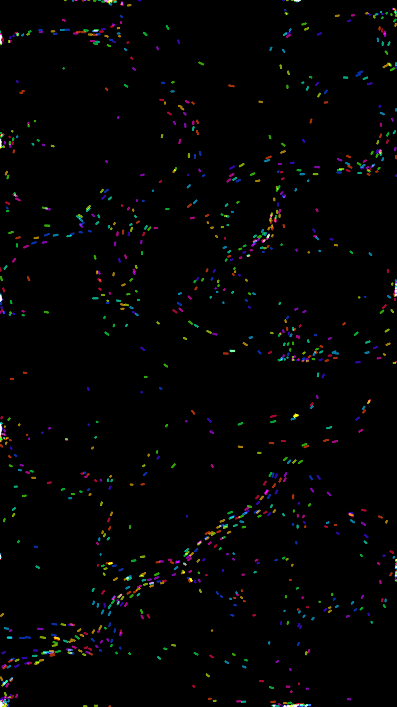
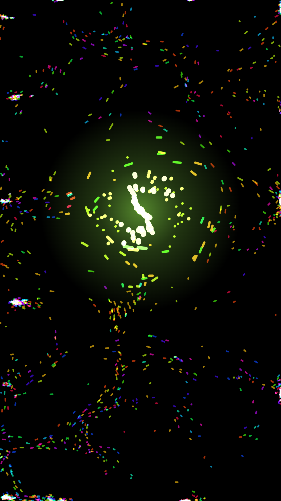
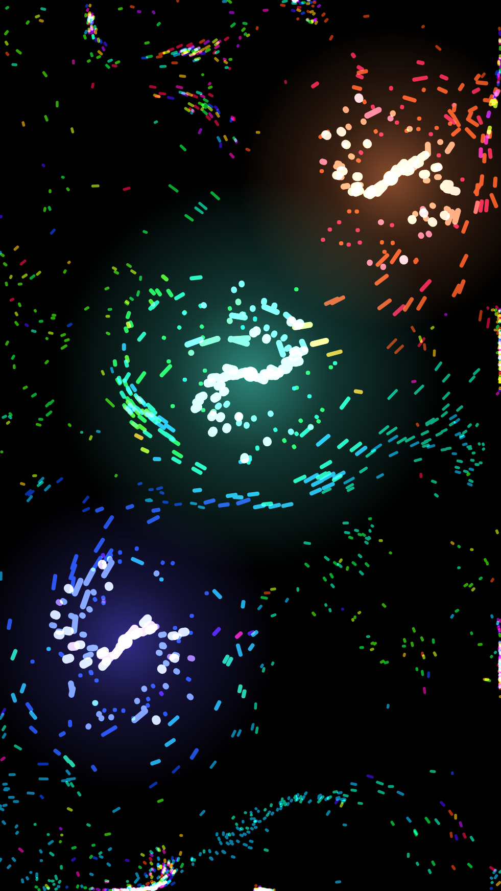
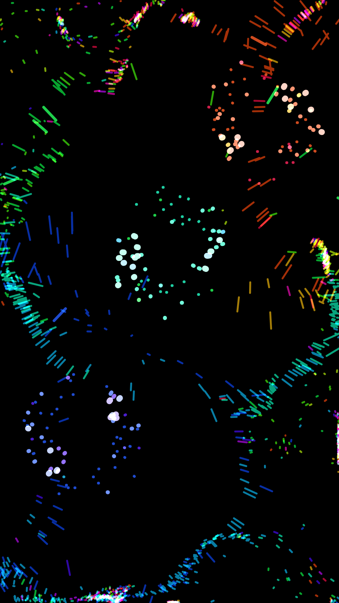
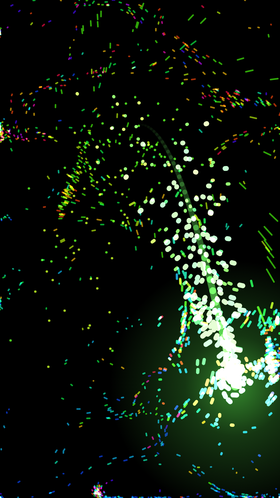

# Partículas ✨

> Um brinquedo de partículas luminosas para crianças: encoste os dedos na tela e
> veja a luz reagir. Sem menus, sem anúncios, sem internet, sem coleta de dados.

[English summary below](#english)


## O que faz

- **Tela cheia, imersiva e fixada**: a criança só interage com as partículas.
  O app pede a *fixação de tela* do Android ao abrir (bloqueia Home/Recentes).
- **Até 10 dedos ao mesmo tempo** (o limite do hardware). Cada dedo vira um
  vórtice com cor própria: atrai, faz girar, e as partículas próximas brilham e
  mudam para a cor dele.
- **Dedo parado nunca fica "morto"**: a cor gira como um arco-íris, o vórtice
  "respira" (suga e empurra em ciclos), a cada 3 s sai um pulso de choque e o
  sentido de rotação inverte, e um chafariz de faíscas em espiral sai do dedo.
- **Arrastar** deixa uma fita luminosa e lança faíscas — quanto mais rápido,
  mais faíscas.
- **Soltar** o dedo explode as partículas com a cor dele.
- **Sem dedo**, as partículas flutuam em correntes suaves com cores girando.
- **Sair**: qualquer tecla física (voltar, volume) desfixa e fecha o app.

| | | | | |
|---|---|---|---|---|
|  |  |  |  |  |

## Instalar

Baixe o `Particulas.apk` da [página de Releases](https://github.com/rodrigofranklin/particulas/releases),
abra no celular e aceite "instalar de fonte desconhecida". Requer Android 8.0+.

> **Fixação de tela.** Para o bloqueio de Home/Recentes funcionar, ative em
> *Configurações → Segurança → Fixar tela* (o nome varia por fabricante). Sem
> isso o app funciona normalmente, só não fixa. Para desfixar manualmente:
> segure **Voltar + Recentes** (ou deslize de baixo e segure, em navegação por gestos).

## Compilar

Requisitos: JDK 17 e Android SDK (plataforma 36, build-tools 36). Não precisa de
Android Studio.

```bash
# aponte o SDK (ou defina ANDROID_HOME)
echo "sdk.dir=/caminho/para/android-sdk" > local.properties

./gradlew assembleDebug      # app/build/outputs/apk/debug/app-debug.apk
./gradlew assembleRelease    # precisa da chave (abaixo)
./gradlew bundleRelease      # .aab para a Play Store
```

### Assinatura

O build `release` espera `app/keystore/particulas.jks` (alias `particulas`,
senhas `particulas`), que **não está no repositório**. Gere a sua:

```bash
keytool -genkeypair -v -keystore app/keystore/particulas.jks -alias particulas \
  -keyalg RSA -keysize 2048 -validity 10000 -storepass particulas -keypass particulas \
  -dname "CN=Particulas, O=SeuNome, C=BR"
```

## Código

Sem dependências além do SDK — dois arquivos Kotlin:

- [`MainActivity.kt`](app/src/main/kotlin/br/com/rfranklin/particulas/MainActivity.kt):
  modo imersivo, fixação de tela, sair com qualquer tecla.
- [`ParticleView.kt`](app/src/main/kotlin/br/com/rfranklin/particulas/ParticleView.kt):
  `SurfaceView` com thread própria; física (campo de fluxo rotacional, vórtices
  por dedo, respiração/pulsos, faíscas, fitas) e desenho em lotes
  (`drawLines` agrupado por matiz × brilho, mistura aditiva).

[`prototype/proto.html`](prototype/proto.html) é uma cópia 1:1 da física em
Canvas/JS, usada para ajustar constantes no navegador
(`python prototype/server.py` e abra `http://localhost:8765/proto.html`).

Os materiais para a loja (ícone, gráfico de destaque, capturas, textos da ficha
e passo a passo de publicação) estão em [`store/`](store/).

## Licença

[MIT](LICENSE). Política de privacidade: [PRIVACY.md](PRIVACY.md).

---

## English

**Partículas** is a full-screen, kiosk-style glowing-particle toy for kids on
Android. Up to 10 simultaneous fingers, each a colored vortex; holding a finger
cycles colors, "breathes", pulses and reverses spin; dragging leaves a light
ribbon and sparks; releasing explodes. No menus, ads, internet or data
collection. Any hardware key exits. Pure Kotlin, no dependencies. MIT licensed.
