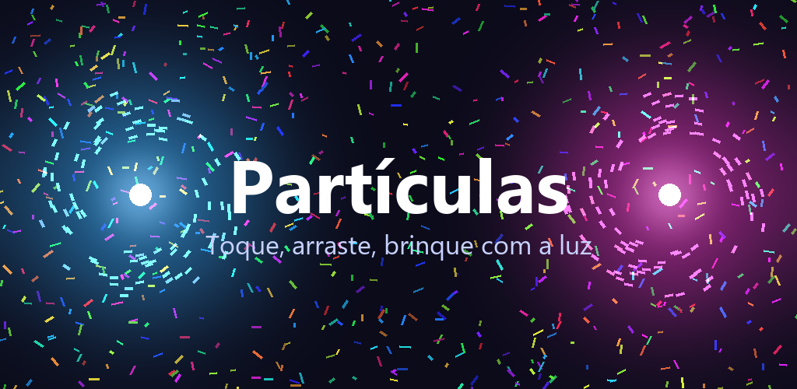
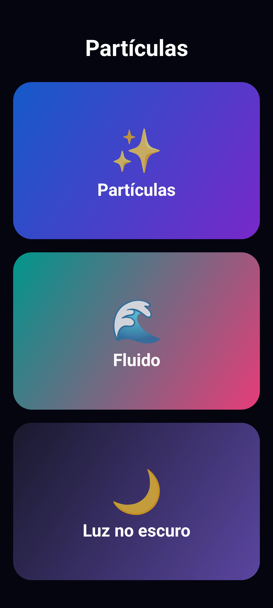
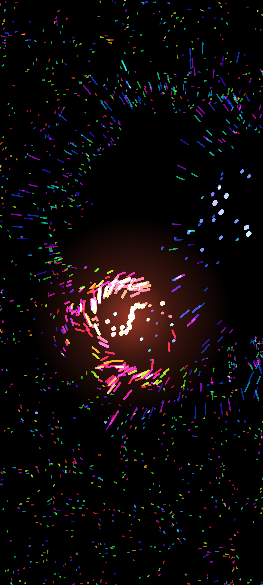
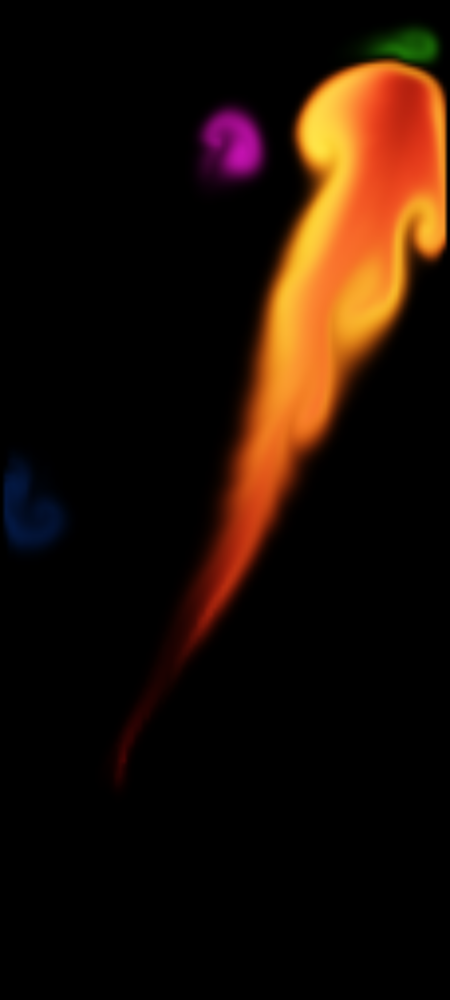
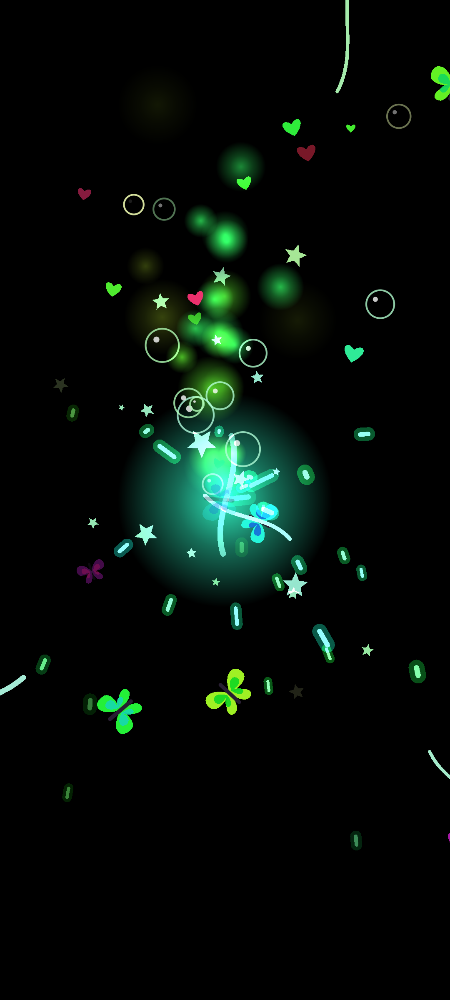

# Partículas ✨

> Um brinquedo de partículas luminosas para crianças: encoste os dedos na tela e
> veja a luz reagir. Sem menus, sem anúncios, sem internet, sem coleta de dados.

[English summary below](#english)



## O que faz

Abre num menu com três botões grandes (feitos para mão de criança) e três modos.
Só retrato — não gira. Tela cheia, imersiva e **fixada** (screen pinning):
Home e Recentes ficam bloqueados enquanto a criança brinca.

**✨ Partículas** — milhares de pontos de luz em correntes suaves. Cada dedo
(até 10 ao mesmo tempo) vira um vórtice com cor própria; dedo parado "respira",
gira a cor como arco-íris, solta pulsos e um chafariz de faíscas; arrastar deixa
uma fita luminosa e faíscas; soltar explode.

**🌊 Fluido** — simulação de fluido de verdade (Navier–Stokes numa grade, estilo
*stable fluids*) com tinta colorida saturada. Arrastar empurra o líquido e deixa
rastros que viram cogumelos e redemoinhos; dedo parado faz uma espiral de cor
girando com pulsos; sem toque, o fluido "respira" cores sozinho.

**🌙 Luz no escuro** — tela preta. Cada dedo é um emissor de coisas brilhantes:
faíscas, fumaça colorida, rajadas de vento, estrelas, bolhas, borboletas
batendo asa e corações. Sai mais quanto mais rápido o dedo anda. Quando os
toques param, tudo se apaga e a tela volta ao preto.

**Sair**: na brincadeira, o botão/gesto **Voltar** volta ao menu; no menu, **Voltar**
desfixa e fecha o app. (Com a tela fixada, o Android entrega ao app só o Voltar;
as teclas de volume passam a ser do sistema. Sem fixação, qualquer tecla física sai.)

| Menu | Partículas | Fluido | Luz no escuro |
|---|---|---|---|
|  |  |  |  |

## Instalar

Baixe o `Particulas.apk` da [página de Releases](https://github.com/rodrigofranklin/particulas/releases),
abra no celular e aceite "instalar de fonte desconhecida". Requer Android 8.0+.

> **Fixação de tela.** Para o bloqueio de Home/Recentes funcionar, ative em
> *Configurações → Segurança → Fixar tela* (o nome varia por fabricante) e
> confirme o diálogo "Fixar este app?" que aparece ao abrir. Sem isso o app
> funciona normalmente, só não fixa. Para desfixar manualmente: segure
> **Voltar + Recentes** (ou deslize de baixo e segure, em navegação por gestos).

## Compilar

Requisitos: JDK 17 e Android SDK (plataforma 36, build-tools 36). Não precisa de
Android Studio.

```bash
# aponte o SDK (ou defina ANDROID_HOME)
echo "sdk.dir=/caminho/para/android-sdk" > local.properties

./gradlew assembleDebug      # app/build/outputs/apk/debug/app-debug.apk
./gradlew assembleRelease    # precisa da chave (abaixo)
./gradlew bundleRelease      # .aab para a Play Store
```

### Assinatura

O build `release` espera `app/keystore/particulas.jks` (alias `particulas`,
senhas `particulas`), que **não está no repositório**. Gere a sua:

```bash
keytool -genkeypair -v -keystore app/keystore/particulas.jks -alias particulas \
  -keyalg RSA -keysize 2048 -validity 10000 -storepass particulas -keypass particulas \
  -dname "CN=Particulas, O=SeuNome, C=BR"
```

## Código

Sem dependências além do SDK, Kotlin puro:

- [`KioskActivity.kt`](app/src/main/kotlin/br/com/rfranklin/particulas/KioskActivity.kt):
  base das telas — modo imersivo, tela ligada, recorte da câmera, teclas físicas.
- [`MenuActivity.kt`](app/src/main/kotlin/br/com/rfranklin/particulas/MenuActivity.kt):
  menu dos três modos e fixação de tela (`startLockTask`).
- [`MainActivity.kt`](app/src/main/kotlin/br/com/rfranklin/particulas/MainActivity.kt):
  a brincadeira — instancia a view do modo escolhido.
- [`SimView.kt`](app/src/main/kotlin/br/com/rfranklin/particulas/SimView.kt):
  base das simulações — `SurfaceView` com thread própria de física + desenho e
  rastreamento de todos os dedos (cada um com cor que gira enquanto está na tela).
- [`ParticleView.kt`](app/src/main/kotlin/br/com/rfranklin/particulas/ParticleView.kt):
  modo Partículas — campo de fluxo rotacional, vórtices por dedo,
  respiração/pulsos, faíscas, fitas; desenho em lotes (`drawLines` por matiz ×
  brilho, mistura aditiva).
- [`FluidView.kt`](app/src/main/kotlin/br/com/rfranklin/particulas/FluidView.kt):
  modo Fluido — *stable fluids* (advecção semi-lagrangiana, projeção
  Gauss-Seidel, confinamento de vorticidade) numa grade de ~3,6 dp por célula,
  tinta RGB com *tone mapping*, desenhada como bitmap ampliado.
- [`EmitterView.kt`](app/src/main/kotlin/br/com/rfranklin/particulas/EmitterView.kt):
  modo Luz no escuro — pool de entidades (faísca, fumaça, vento, estrela, bolha,
  borboleta, coração, anel) com vida curta, emitidas ao longo do caminho do dedo.

[`prototype/proto.html`](prototype/proto.html) é uma cópia 1:1 da física do modo
Partículas em Canvas/JS, usada para ajustar constantes no navegador
(`python prototype/server.py` e abra `http://localhost:8765/proto.html`).
[`tools/emu.sh`](tools/emu.sh) compila, instala e captura telas no emulador
(as capturas em `store/screenshots/` vieram de lá).

Os materiais para a loja (ícone, gráfico de destaque, capturas, textos da ficha
e passo a passo de publicação) estão em [`store/`](store/).

## Licença

[MIT](LICENSE). Política de privacidade: [PRIVACY.md](PRIVACY.md).

---

## English

**Partículas** is a full-screen, kiosk-style (screen-pinned, portrait-only)
light toy for kids on Android with three modes: **Particles** (thousands of
glowing particles, up to 10 simultaneous finger vortices with color cycling,
breathing, pulses, ribbons and sparks), **Fluid** (a real stable-fluids
Navier–Stokes solver with saturated dye) and **Light in the dark** (black
screen; each finger emits sparks, colored smoke, wind, stars, bubbles,
butterflies and hearts that fade away when touching stops). No ads, internet or
data collection. Back exits. Pure Kotlin, no dependencies. MIT licensed.
